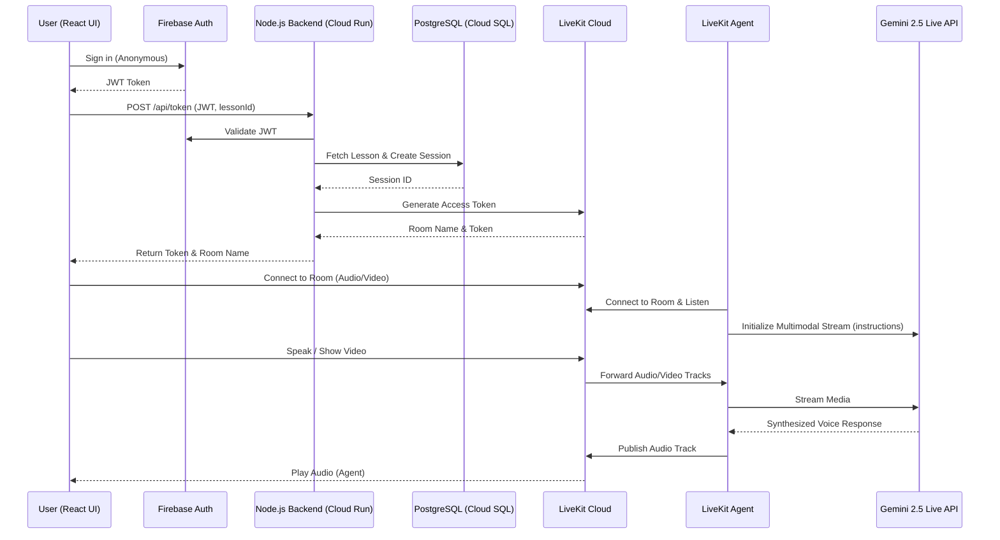

# Logical Architecture: AI Language Tutor

```mermaid
sequenceDiagram
    participant U as User (React UI)
    participant FA as Firebase Auth
    participant BE as Node.js Backend (Cloud Run)
    participant DB as PostgreSQL (Cloud SQL)
    participant LK as LiveKit Cloud
    participant AG as LiveKit Agent
    participant G as Gemini 2.5 Live API

    U->>FA: Sign in (Anonymous)
    FA-->>U: JWT Token
    U->>BE: POST /api/token (JWT, lessonId)
    BE->>FA: Validate JWT
    BE->>DB: Fetch Lesson & Create Session
    DB-->>BE: Session ID
    BE->>LK: Generate Access Token
    LK-->>BE: Room Name & Token
    BE-->>U: Return Token & Room Name
    U->>LK: Connect to Room (Audio/Video)
    AG->>LK: Connect to Room & Listen
    AG->>G: Initialize Multimodal Stream (instructions)
    U->>LK: Speak / Show Video
    LK->>AG: Forward Audio/Video Tracks
    AG->>G: Stream Media
    G-->>AG: Synthesized Voice Response
    AG->>LK: Publish Audio Track
    LK-->>U: Play Audio (Agent)
```
